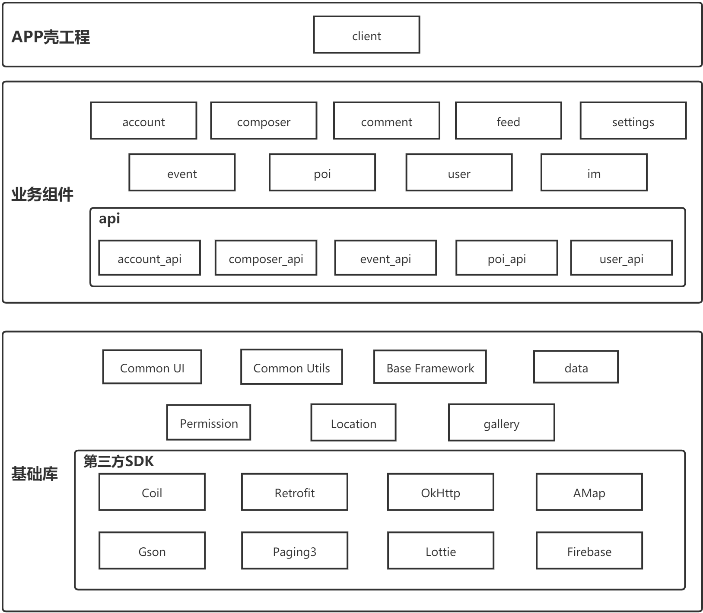
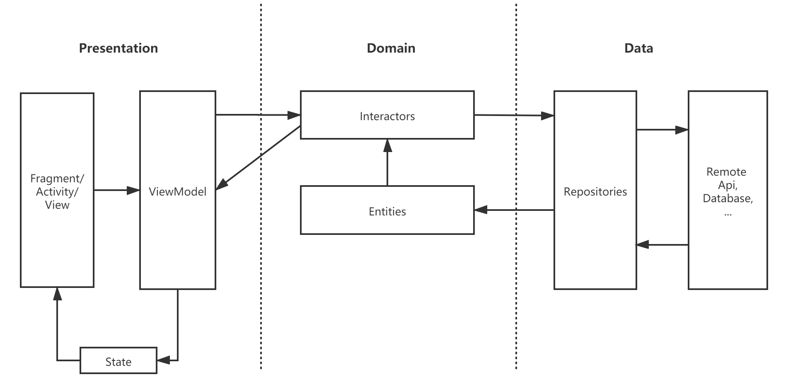

# Melon🍉(work-in-progress)

Melon is a **work-in-progress** social media app, which is inspired by Twitter app.

## Sample app

> The posts displayed in sample app are collected from [weibo.com](https://weibo.com) with [weiboSpider](https://github.com/dataabc/weiboSpider). All rights belong to their respective authors. Please contact me is there is any wrong usage of them and I would delete them as soon as possible.

| Feed                        | User                        | Content Posting             |
| --------------------------- | --------------------------- | --------------------------- |
|  |  |  |

## Features

* Mostly written in [Kotlin](https://kotlinlang.org/)
* Modularization
* [Kotlin Coroutines](https://kotlinlang.org/docs/reference/coroutines/coroutines-guide.html)
* Android architecture components and Jetpack
* Dependency Injection

## Build With

* [Retrofit](https://github.com/square/retrofit) + [OkHttp](https://github.com/square/okhttp) - RESTful API and networking client.
* [Gson](https://github.com/google/gson) - Serialization/Deserialzation handling.
* [Dagger](https://github.com/google/dagger) - Dependency injection.
* [Android Architecture Components](https://developer.android.com/topic/libraries/architecture) - a collection of libraries that helps build robust, testable and maintainable apps.
  * [View Binding](https://developer.android.com/topic/libraries/view-binding) - a feature that provides a safer way to interact with views.
  * [Lifecycle](https://developer.android.com/topic/libraries/architecture/lifecycle) - provides classes and interfaces that let you build lifecycle-aware components.
  * [LiveData](https://developer.android.com/topic/libraries/architecture/livedata) - an lifecycle-aware and observable data holder class.
  * [ViewModel](https://developer.android.com/topic/libraries/architecture/viewmodel) - store and manage UI-related data in a lifecycle conscious way.
  * [Paging3](https://developer.android.com/topic/libraries/architecture/paging/v3-overview) - helps load the display pages of data from a larger dataset from local storage or over network.
* [Android Jetpack Components](https://developer.android.com/jetpack) - a suite of libraries to write high-quality code.
  * [Navigation](https://developer.android.com/guide/navigation) - build and structure in-app UI, and navigate between screens.
  * [Preference](https://developer.android.com/jetpack/androidx/releases/preference) - build interactive settings screens without needing to interact with device storage or manage the UI.
  * [Room](https://developer.android.com/training/data-storage/room?hl=en) - manage persistent data storage.
* [Material Design Components](https://material.io/develop/android) - a suite of widgets in Material Design style.
* [Coil](https://github.com/coil-kt/coil) - Image loading library backed by Kotlin Coroutines.
* [Epoxy](https://github.com/airbnb/epoxy) - Simplified way to build complex layout in RecyclerView.
* [AMap](https://lbs.amap.com/) - A Library for locating and map displaying.
* [Lottie](https://github.com/airbnb/lottie-android) - Render After Effects animations natively.
* [JMessage](https://docs.jiguang.cn/jmessage/guideline/jmessage_guide/) - Instant messaging.
* [PhotoView](https://github.com/Baseflow/PhotoView) - Implementation of ImageView for Android that supports zooming, by various touch gestures.
* [uCrop](https://github.com/Yalantis/uCrop) - Image Cropping Library.
* [ByteX](https://github.com/bytedance/ByteX) - A bytecode plugin platform based on Android Gradle Transform API and ASM.
* [AndResGuard](https://github.com/shwenzhang/AndResGuard) - A tool to obfuscate resource files.

## Architecture





## Development setup

### Signing config

The app uses signing config from `local.properties` as it is displayed in `~/app/build.gradle.kts`, you may need to fill keystore paths and related informations for normal building.

```kotlin
signingConfigs {
    getByName("debug") {
        storeFile = file(gradleLocalProperties(rootDir).getProperty("keystore.debug.filename"))
        storePassword = gradleLocalProperties(rootDir).getProperty("keystore.debug.storePassword")
        keyAlias = gradleLocalProperties(rootDir).getProperty("keystore.debug.keyAlias")
        keyPassword = gradleLocalProperties(rootDir).getProperty("keystore.debug.keyPassword")
    }
    create("release") {
        storeFile = file(gradleLocalProperties(rootDir).getProperty("keystore.release.filename"))
        storePassword = gradleLocalProperties(rootDir).getProperty("keystore.release.storePassword")
        keyAlias = gradleLocalProperties(rootDir).getProperty("keystore.release.keyAlias")
        keyPassword = gradleLocalProperties(rootDir).getProperty("keystore.release.keyPassword")
    }
}
```

### API Key

You need to supply API / client keys for various services the app uses:

- [AMap](https://lbs.amap.com/api/android-location-sdk/guide/create-project/get-key)
- [JMessage](https://docs.jiguang.cn/jmessage/guideline/jmessage_guide/)

You can find information about how to gain access via the relevant links.

Once you obtain the keys, you need to set them in your `local.properties`

```
# Get this from amap
amap_api_key=*****

# Get this from JMessage
jpush_api_key=*****
```

## License

```
Copyright 2021 Raymond Wong

Licensed under the Apache License, Version 2.0 (the "License");
you may not use this file except in compliance with the License.
You may obtain a copy of the License at

   http://www.apache.org/licenses/LICENSE-2.0

Unless required by applicable law or agreed to in writing, software
distributed under the License is distributed on an "AS IS" BASIS,
WITHOUT WARRANTIES OR CONDITIONS OF ANY KIND, either express or implied.
See the License for the specific language governing permissions and
limitations under the License.
```